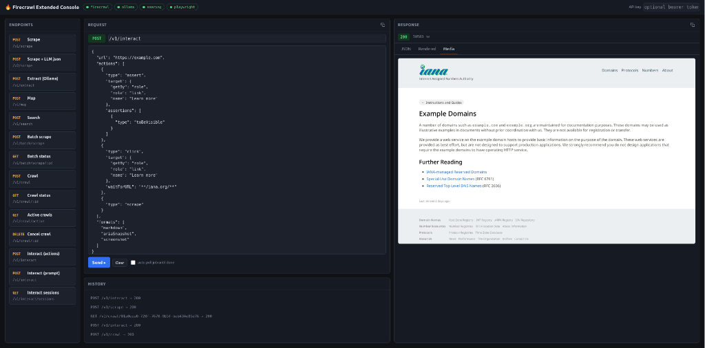

# firecrawl-extended

Self-hosted [Firecrawl](https://github.com/firecrawl/firecrawl) with a unified
REST gateway, a web console, an MCP interface, a custom Playwright interaction
service, and Ollama-backed LLM extraction.

```
 external:
   browser / curl ─▶ :18080  gateway   single REST interface + web console
   mcp clients    ─▶ :18081  mcp       Streamable HTTP; calls gateway internally
   other stacks   ─▶ :13000  playwright-service   shared JS-rendering endpoint

 gateway routes:
   /v0, /v1, /v2  (any path)   ─▶ api        upstream Firecrawl API + workers
   /v1/interact                ─▶ interact   Playwright browser sessions
   /v1/extract                 ─▶ shim: map/search ─▶ /v2/scrape ─▶ ollama
   /  /api  /status  /healthz  ─▶ gateway itself

 internal:    api ─▶ playwright-service · redis · rabbitmq · nuq-postgres
 llm-network: api, interact, gateway, playwright-service ─▶ ollama :11434 · searxng :8080
 app-network: gateway ─▶ other docker stacks (firecrawl-extended-gateway:8080)
```

## Why I built this

The open-source Firecrawl is a solid fetch-based scraper, but self-hosting it
leaves a few gaps:

- **No real browser you can drive.** Upstream scrapes via a fast HTTP/fetch
  engine whenever possible, and interactive `actions` are gated behind the
  commercial Fire Engine — so no clicking, form-filling, or reliable
  screenshots. `POST /v1/interact` fills that gap with full Playwright:
  locators, waits, assertions, tracing, all three engines.
- **The extract job API was deprecated upstream.** The gateway re-implements
  `/v1/extract` synchronously on top of `/v2/scrape`, with a local Ollama
  model doing the structured extraction — no external LLM calls.
- **No single front door or UI.** Upstream exposes the API on its own port
  and ships no console. Here everything — upstream endpoints, interact,
  extract — sits behind one gateway on `:18080`, with a built-in web console
  for driving it, and an MCP interface on `:18081` so agents get the same
  surface as tools.

## Services

| Container | Image / build | Role |
|---|---|---|
| `firecrawl-extended-gateway` | `./gateway` | **The one external REST interface** (`:18080`). Serves the web console at `/`, proxies every upstream endpoint (`/v0`–`/v2`), adds `/v1/interact` + a working `/v1/extract`. Optional bearer auth. Also reachable by other docker stacks on `app-network` as `firecrawl-extended-gateway:8080`. |
| `firecrawl-extended-mcp` | `./mcp` | **The MCP interface** (`:18081/mcp`, Streamable HTTP). All Firecrawl capabilities as tools; forwards `GATEWAY_API_KEY`. |
| `firecrawl-extended-interact` | `./interact` | Custom Playwright service backing `POST /v1/interact`: stateful sessions, full action surface, Ollama prompt→action planner. Internal only. |
| `firecrawl-extended-api` | `ghcr.io/firecrawl/firecrawl` | Upstream API + embedded workers. Not published — reachable only via the gateway. |
| `playwright-service` | `ghcr.io/firecrawl/playwright-service` | Upstream JS-rendering microservice used by `api`. Shared: also on `llm-network` and published on the host at `:13000` for non-docker consumers. |
| `firecrawl-extended-redis` | `redis:alpine` | Rate limits / queue state (AOF on, `./data/redis`). |
| `firecrawl-extended-rabbitmq` | `rabbitmq:3-management` | Job queue (`./data/rabbitmq`). |
| `firecrawl-extended-nuq-postgres` | `ghcr.io/firecrawl/nuq-postgres` | NuQ job store (`./data/postgres`). |

All data persists on the host under `./data/` (postgres, rabbitmq, redis,
interact artifacts). `data/fdb` and `data/firecrawl-postgres` are leftovers
from earlier deployments and unused — safe to delete.

## External dependencies

The stack expects an **Ollama** container and a **SearXNG** container (JSON
output enabled) reachable by DNS name on the shared Docker network
`llm-network` — on this host they already exist and provide `llama3.1:8b` +
`nomic-embed-text`. `api` and `interact` join that network and reach them as
`http://ollama:11434` and `http://searxng:8080`.

On a fresh host:

```bash
docker network create llm-network
docker run -d --name ollama --network llm-network -p 11434:11434 \
  -v ollama-data:/root/.ollama ollama/ollama
docker exec ollama ollama pull llama3.1:8b && docker exec ollama ollama pull nomic-embed-text
docker run -d --name searxng --network llm-network -p 8088:8080 \
  -v "$PWD/searxng:/etc/searxng" searxng/searxng   # uses searxng/settings.yml (JSON enabled)
```

Or point `OLLAMA_BASE_URL` / `SEARXNG_ENDPOINT` in `.env` at any reachable
instance (e.g. `http://host.docker.internal:11434`).

## Quick start

```bash
cp .env.example .env        # set POSTGRES_PASSWORD (and optionally GATEWAY_API_KEY)
docker compose up -d
```

Verify:

```bash
curl -s http://localhost:18080/healthz
curl -s -X POST http://localhost:18080/v1/scrape \
  -H 'Content-Type: application/json' \
  -d '{"url": "https://example.com", "formats": ["markdown"]}'
```

## Web console

`http://localhost:18080/` serves a self-contained console UI (single page, no
build step, no external assets) that talks to the gateway same-origin — no
CORS or extra ports.



Features:

- **Live service status pills** in the header — firecrawl, ollama, searxng,
  playwright — probed via `GET /status` every 15 s (green ok / orange
  degraded / red down, with latency + error tooltip).
- **Endpoint presets** (scrape, v2 scrape-json, extract, map, search, batch,
  crawl lifecycle, interact, sessions) grouped by workflow; each fills
  method badge + path + body.
- **Request builder**: color-coded read-only method badge (set by presets),
  free-form path with `:param` placeholders (`/v1/crawl/:id` auto-fills from
  the last job id or prompts), JSON body editor that auto pretty-prints.
- **Response viewer**: status + latency badge, three tabs — pretty JSON,
  rendered markdown (link extraction, hard-break cleanup, images pulled
  out), and media (screenshots/PDF inline + images extracted from markdown).
- **Copy icons** in each panel header: request → full cURL command; response
  → whatever the active tab shows (JSON text, markdown source, or the
  screenshot as a real image on the clipboard).
- **Job polling**: POSTs returning a job `id` get a "Poll job" button plus an
  auto-poll-until-done toggle.
- **History panel** below Request: the 5 most recent requests as a clickable
  list (20 kept in `localStorage`).
- API key field (bearer, persisted in `localStorage`).

The machine-readable endpoint listing lives at `GET /api`.

## REST endpoints (through the gateway, `:18080`)

All upstream endpoints are proxied verbatim — request/response shapes match
the [Firecrawl API reference](https://docs.firecrawl.dev/api-reference/introduction).

| Endpoint | Description |
|---|---|
| `GET /healthz` | Gateway health |
| `GET /api` | JSON listing of all endpoints |
| `GET /status` | Per-service health (firecrawl/ollama/searxng/playwright) — powers the console pills |
| `POST /v1/scrape` | Scrape a URL → markdown/html/links/screenshot/json |
| `POST /v2/scrape` | v2 scrape — same + structured `json` formats: `[{type:"json", prompt, schema}]` |
| `POST /v2/batch/scrape` | Async batch scrape → job id |
| `GET/DELETE /v2/batch/scrape/:id` | Batch status / cancel (+ `/errors`) |
| `POST /v2/crawl` | Async crawl → job id |
| `GET/DELETE /v2/crawl/:id` | Crawl status / cancel (+ `/errors`, `GET /v2/crawl/active`) |
| `POST /v2/map` | Discover all URLs on a site |
| `POST /v2/search` | Web search via SearXNG — results under `data.web`; `scrapeOptions` scrapes each hit |
| `POST /v1/extract` | **Shimmed.** LLM extraction via Ollama — expands `*` URLs via `/v2/map`, falls back to `/v2/search` when only `prompt` is given, synchronous result |
| `POST /v1/research` | **Custom.** Composed answer endpoint — Ollama decomposes compound questions into focused sub-queries, `/v2/search` runs each (with per-result markdown scrape), results are round-robin merged, then Ollama synthesizes `{answer, queries, rounds, sources, documents}`; facets the documents couldn't answer are reported as `gaps`, triggering one more retrieval round targeted at them |
| `POST /v1/interact` | **Custom.** Playwright-driven interaction (below) |
| `POST /v1/interact/async` | Same body, returns a job `id` immediately |
| `GET /v1/interact/jobs/:id` | Poll an async interact job — live `events`, `actionsLog`, `transcript`, `answer`, `data` |
| `GET/POST /v1/interact/sessions` | List / create interact sessions |
| `DELETE /v1/interact/sessions/:id` | Close a session |
| `GET /v1/interact/sessions/:id/artifacts/:name` | Fetch trace.zip / session.har / video artifacts |

Any other `/v0`, `/v1`, or `/v2` path is forwarded to the upstream API as-is.

### `POST /v1/interact`

Playwright-backed interactive browser sessions implementing the API surface
from <https://playwright.dev/>. Bodies accept either an `actions` list or a
`prompt` driven by Ollama's agent loop.

```json
{
  "url": "https://news.ycombinator.com",
  "browser": "chromium",
  "device": "Desktop Chrome",
  "actions": [
    { "type": "click", "target": { "getBy": "role", "role": "link", "name": "new" } },
    { "type": "fill", "target": { "getBy": "label", "value": "Search" }, "text": "firecrawl" },
    { "type": "press", "key": "Enter", "waitForLoadState": "networkidle" },
    { "type": "assert", "target": { "selector": "title" },
      "assertions": [{ "type": "toContainText", "value": "Hacker" }] },
    { "type": "scrape" }
  ],
  "formats": ["markdown", "links", "ariaSnapshot", "console", "errors", "network"],
  "keepSession": true
}
```

**Targets** follow playwright.dev locator best practices — prefer
`{"getBy":"role|text|label|placeholder|altText|title|testId", ...}` or
`"role=button[name='Save']"` / `"text=Foo"` over brittle CSS. Modifiers:
`nth`, `first`, `last`, `hasText`, `has`, `hasNot`, `visible`, `frame`.
Strict mode is enforced — a locator matching multiple elements fails unless
disambiguated.

**Actions** — navigation: `goto`, `goBack`, `goForward`, `reload` · waits:
`wait`, `waitForSelector`, `waitForLoadState`, `waitForURL`,
`waitForFunction`, `waitForRequest`, `waitForResponse`, `waitForPopup`,
`waitForDownload` · input: `click`, `dblclick`, `rightClick`, `hover`, `tap`,
`fill`, `type`, `press`, `insertText`, `check`, `uncheck`, `setChecked`,
`selectOption`, `setInputFiles` (base64 files), `dragAndDrop`, `focus`,
`blur`, `scrollIntoView`, `scroll`, `wheel`, `mouseMove/Click/Down/Up`,
`touchTap` · capture: `scrape`, `screenshot` (clip/mask/quality/
omitBackground/animations), `pdf` (chromium), `text`, `innerText`,
`innerHTML`, `inputValue`, `attribute`, `count`, `ariaSnapshot`, `evaluate`,
`is*` family · assertions (web-first, polled): `assert` with
`toBeVisible/Hidden/Enabled/Disabled/Checked/Focused/Empty`,
`toHaveText/ContainText/Value/Attribute/CSS/Class/Id/Count/URL/Title` ·
dialogs/downloads/tabs: `dialog` (accept/dismiss), `download` (trigger +
capture), `newTab`, `switchTab`, `closeTab` · state: `getCookies`,
`setCookies`, `clearCookies`, `storageState` (export/import), localStorage
and sessionStorage get/set/clear, `grantPermissions`, `setGeolocation`,
`setOffline`, `setExtraHTTPHeaders`, `emulateMedia`, `setViewportSize`,
`setContent`, `addInitScript`, `addScriptTag`, `addStyleTag`, clipboard
read/write · network: `route` (abort/fulfill/mock/rewrite), `unroute`,
`blockResources`, `apiRequest` · observability: `startTracing`,
`stopTracing` (trace.zip artifact), `recordVideo`/`recordHar` session
options, `cdp` (chromium DevTools protocol), `clock` (time mocking).

**Concurrent waits** — trigger actions accept `waitForResponse`,
`waitForRequest`, `waitForURL`, `expectPopup`, `expectDownload`,
`acceptDialog`, `dismissDialog` inline options (armed before the trigger
runs).

**Session options** (at creation or per-request without `sessionId`):
`browser` (chromium|firefox|webkit), `device` (any Playwright device
descriptor — also selects the engine), `viewport`, `screen`, `userAgent`,
`locale`, `timezoneId`, `geolocation` (auto-grants permission),
`permissions`, `colorScheme`, `reducedMotion`, `forcedColors`, `isMobile`,
`hasTouch`, `deviceScaleFactor`, `extraHTTPHeaders`, `httpCredentials`,
`offline`, `ignoreHTTPSErrors`, `bypassCSP`, `javaScriptEnabled`,
`acceptDownloads`, `serviceWorkers`, `storageState`, `baseURL`, `proxy`,
`recordVideo`, `recordHar`, `strictSelectors`, `launchArgs` (extra browser
launch arguments, e.g. `["--disable-http2"]`). If the initial navigation
fails and no `launchArgs` were given, the request is retried once on a
browser launched with `INTERACT_FALLBACK_LAUNCH_ARGS` — sessions that used
it report `usedFallbackArgs` in `GET /v1/interact/sessions`.

**Formats**: `markdown`, `html`, `rawHtml`, `links`, `screenshot`,
`screenshot@fullPage`, `pdf`, `ariaSnapshot`, `console`, `errors`,
`network`, `cookies`, `storageState`, `tabs`.

**Prompt mode (agent loop).** Send `prompt` instead of `actions` and the
service iterates: snapshot the page (visible text + interactive elements with
hrefs) → ask Ollama for the next actions or a final answer → execute → repeat,
up to `maxSteps` (default 5, max 12). The model replies `{"actions":[...]}`
to keep working or `{"done":true,"answer":"..."}` to finish. `model` overrides
`OLLAMA_MODEL` per request — see "Model choice" below. Prompt-mode defaults:
`timeout` 300s (vs 120s for explicit actions), `stopOnFailure` off within
steps, and per-action waits capped at 10s.

**Vision grounding.** When `INTERACT_VISION_MODEL` is set (or per request via
`vision: true` / `vision: "<model>"`), each agent step also sends a page
screenshot to that VLM and appends its description to the snapshot — catches
cookie walls, modals and visual content that DOM text misses.

**Other request flags:** `adblock: true` aborts tracker/ad network requests
(default via `INTERACT_ADBLOCK`); `maxSteps`, `model`, `vision`, `timeout`
as above.

**Async mode.** `POST /v1/interact/async` accepts the same body and returns
`{id, statusUrl}` immediately. `GET /v1/interact/jobs/:id` returns live
`events`/`actionsLog`/`transcript` while running, then `answer`/`data`/
`error` on `completed`/`failed` — finished jobs are retained for
`INTERACT_JOB_TTL_MS` (default 10 min). The console streams job events into
its Logs pane while polling.

Responses include `actionsLog` (per-action status/results), `data`, `events`
(chronological browser timeline: navigations, console messages, page errors,
failed requests, HTTP≥400 responses, dialogs, downloads — also streamed to the
console's Logs pane), and a `sessionId` when `keepSession` is set. Prompt-mode
responses additionally include `answer` (the model's final answer when it
declares `done`), `plannedActions` (the full executed plan), and `transcript`
(step-by-step progress notes fed back to the model). Sessions expire after
`INTERACT_SESSION_TTL_MS` idle (default 10 min) and are capped by
`INTERACT_MAX_SESSIONS` (default 10). Artifacts persist under
`./data/artifacts/` — including an `events.jsonl` timeline written at session
close — and are retrievable via `GET /v1/interact/sessions/:id/artifacts/:name`
(including `events` on live sessions) or the `artifact` action.

## MCP interface

Streamable HTTP at `http://localhost:18081/mcp`. Example client config:

```json
{
  "mcpServers": {
    "firecrawl": { "url": "http://localhost:18081/mcp" }
  }
}
```

Tools: `firecrawl_scrape`, `firecrawl_batch_scrape`,
`firecrawl_batch_scrape_status`, `firecrawl_crawl`, `firecrawl_crawl_status`,
`firecrawl_crawl_cancel`, `firecrawl_map`, `firecrawl_search`,
`firecrawl_extract`, `firecrawl_extract_status`, `firecrawl_research`,
`firecrawl_interact`, `firecrawl_interact_async`,
`firecrawl_interact_job_status`, `firecrawl_interact_sessions`,
`firecrawl_interact_close_session`.

## Configuration

`.env` (gitignored) and `.env.example` carry the same commented key set —
keep them in sync. Notables:

- `POSTGRES_PASSWORD` — required.
- `GATEWAY_PORT` / `MCP_PORT` / `PLAYWRIGHT_HOST_PORT` — published ports
  (18080 / 18081 / 13000).
- `GATEWAY_API_KEY` — set to require `Authorization: Bearer <key>` on the
  REST interface (and the web console); the MCP server forwards it
  automatically.
- `OLLAMA_BASE_URL` / `OLLAMA_MODEL` / `OLLAMA_EMBEDDING_MODEL` —
  extraction/planning backend (default `llama3.1:8b`, already pulled in the
  shared Ollama). Larger models extract and plan better — interact `prompt`
  mode also accepts a per-request `model` override.
- `OLLAMA_KEEP_ALIVE` — how long Ollama keeps the model resident between
  calls (default `30m`; `-1` = never unload). Large models (27b+) can take
  >1min to cold-load on CPU, which shows up as a timeout on the first call
  after idle. `OLLAMA_TIMEOUT_MS` tunes the per-call Ollama timeout
  (default `180000`).

### Model choice

`OLLAMA_MODEL` backs three things: `/v1/extract` extraction, `/v2/scrape`
`json` formats (upstream `MODEL_NAME`), and `/v1/interact` prompt-mode
planning. The interact prompt loop is the most demanding consumer — the model
must read a page snapshot, decide whether it already has the answer, and emit
strict JSON. What actually matters, measured on this stack:

| Model class | Examples | Behavior in prompt mode |
|---|---|---|
| Reasoning/"thinking" | `qwen3:8b`, `qwen3:14b`, `qwen3.6:27b` | Best. Reads the snapshot, answers `done` when it should, routes to the right pages. Slower per call (thinking preamble) but wastes far fewer steps. |
| Large instruct | `qwen2.5:32b-instruct`, `qwen2.5:14b` | Good JSON, weaker judgment — tends to over-explore (visited 4 ship pages individually instead of using the destination filter) and may not converge to `done` within `maxSteps`. |
| Tool-use fine-tunes | `llama3-groq-tool-use`, `hermes3:8b` | Poor fit. Tuned for OpenAI function schemas, not freeform plans — `groq-tool-use` looped `goto` forever, `hermes3` browsed well but never stopped. |
| Small instruct | `llama3.1:8b` (baseline) | Works for trivial tasks; emits placeholder selectors and stalls on anything multi-step. |

Practical guidance:

- **`qwen3:14b` is the best default** — fast enough per step, and in testing
  it answered a "report the top story" task in a single step with zero wasted
  actions. `qwen3:8b` scored identically and is faster still.
- **Hard multi-step tasks**: pass `"model": "qwen3.6:27b"` (or similar) in the
  request body — heavier thinking models route much better, at ~60-90s per
  step on CPU.
- **`/v1/extract`** is less sensitive — it's a single constrained JSON
  generation, so even mid-size instruct models extract well. Model size
  mostly buys robustness on ambiguous pages.
- Thinking models emit their reasoning in a separate `thinking` field under
  `format:"json"`, so the planner output stays clean — but budget extra time
  per step (`maxSteps × ~30-90s` at 14b on CPU).
- `SEARXNG_ENDPOINT` / `SEARXNG_ENGINES` / `SEARXNG_CATEGORIES` — search
  backend + tuning.
- `INTERACT_SESSION_TTL_MS` / `INTERACT_MAX_SESSIONS` — session lifecycle;
  `INTERACT_JOB_TTL_MS` — retention for finished async jobs.
- `INTERACT_VISION_MODEL` — VLM describing screenshots during prompt-mode
  steps (empty disables; request field `vision` overrides).
- `INTERACT_ADBLOCK` — set `1` to abort tracker/ad requests in all sessions
  (per-request `adblock` flag overrides).
- `INTERACT_FALLBACK_LAUNCH_ARGS` — comma-separated browser launch args
  retried once when a page fails to load (default
  `--disable-http2,--disable-blink-features=AutomationControlled`, which
  helps with CDNs that reject headless HTTP/2).
- `NUM_WORKERS_PER_QUEUE`, `CRAWL_CONCURRENT_REQUESTS`,
  `MAX_CONCURRENT_JOBS`, `BROWSER_POOL_SIZE`, `BLOCK_MEDIA`,
  `HARNESS_STARTUP_TIMEOUT_MS`, `LOGGING_LEVEL` — upstream tuning.
- `MAX_CONCURRENT_PAGES`, `PROXY_SERVER`, `PROXY_USERNAME`,
  `PROXY_PASSWORD`, `ALLOW_LOCAL_WEBHOOKS` — playwright-service tuning.

## Testing

`scripts/test-api.mjs` exercises every endpoint at full complexity and prints a
PASS/FAIL report (exit code 1 on failure):

```bash
node scripts/test-api.mjs                  # full suite (~2-3 min; LLM tests included)
node scripts/test-api.mjs --fast           # skip Ollama-heavy tests (~30s)
node scripts/test-api.mjs --only research  # run tests matching a substring
node scripts/test-api.mjs --report out.json  # also write a JSON report
```

Covers: health/status, v1+v2 scrape (incl. `json` extraction format), search,
map, batch-scrape and crawl job lifecycles (with cancel fallback), `/v1/extract`,
`/v1/research` (asserts query decomposition + gap-driven second round), interact
actions/async-jobs/session lifecycle + artifacts, prompt-mode agent, negative
cases, and the MCP interface (`tools/list` + a real `tools/call` through the
gateway). Env overrides: `GATEWAY`, `MCP`, `GATEWAY_API_KEY`.

## Notes & limits

- Same open-source limits as upstream self-hosted Firecrawl: no Firecrawl
  Cloud features (Agent, billing), `/search` quality depends on the SearXNG
  engines, and extraction quality depends on the local model.
- Upstream deprecated the async `/v1/extract` job API; the gateway
  implements a synchronous equivalent on top of `/v2/scrape` + Ollama, so
  `GET /v1/extract/:id` (job polling) is not meaningful here.
- Upstream `/v1/scrape` picks its cheap fetch engine whenever the page is
  fetchable, and that engine can't take screenshots or run `actions`
  (actions require upstream's commercial Fire Engine) — the response carries
  a `"may be partial"` warning and no `data.screenshot`. For reliable
  browser rendering/screenshots/PDF use `POST /v1/interact`.
- `api`, `interact`, and the queue infra are internal-only — the outside
  reaches them solely through `gateway` on `:18080` (plus MCP on `:18081`).
- `api` is capped at 4 CPU / 8 GB, `playwright-service` at 2 CPU / 4 GB
  (see `docker-compose.yaml`); raise or remove for heavier workloads.
